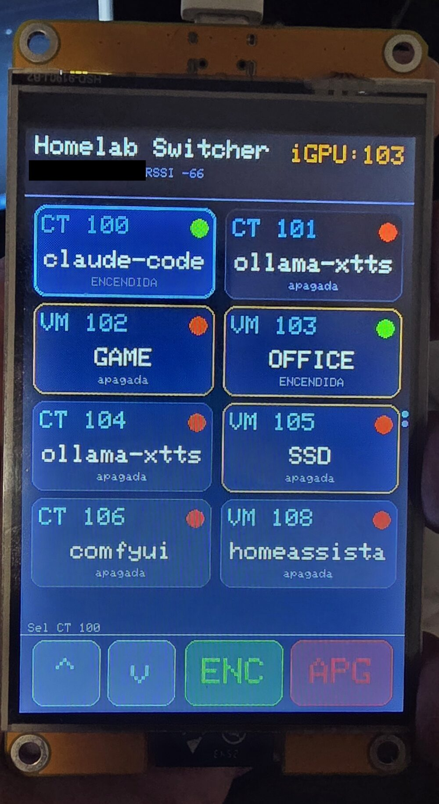
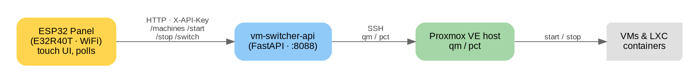

# esp32-proxmox-panel

A **touch panel for a Proxmox VE host**: an ESP32 with a 4" touch screen that lists every VM and
LXC container and lets you start / stop (and iGPU-switch) them from the screen — no browser, no SSH.

<p align="center">
  
</p>

The panel is a thin WiFi client; all the Proxmox logic lives in a small FastAPI backend that talks to
the host over SSH using `qm` and `pct`.



## Features

- **Dynamic list** of every VM and CT with live status, continuously refreshed.
- **Start / stop** any machine from the screen (graceful ACPI shutdown).
- **iGPU-group switch**: a long-press on a GPU-passthrough VM shuts down the active one and boots the
  target — mutual exclusion for a shared passthrough GPU, done atomically.
- **~millisecond latency**: the backend refreshes state in a background thread and serves from cache,
  so the panel never waits for Proxmox's inventory.
- **OTA firmware updates** over WiFi (after the first USB flash).
- **Custom 3D-printed case**, modeled parametrically in OpenSCAD from the board's official drawing.

## Repository layout

| Folder | What |
|---|---|
| `firmware/` | PlatformIO project for the ESP32 (TFT_eSPI). `secrets.example.h` → copy to `secrets.h`. |
| `backend/`  | `vm-switcher-api`, a FastAPI service (`/machines`, `/start`, `/stop`, `/switch`, …). |
| `case/`     | Two-part 3D-printable case (`base.stl` + `bezel.stl`) + parametric `e32r40t_case.scad`. |
| `docs/`     | Architecture diagram and photos. |

## Hardware

- **LCDWIKI E32R40T**: an ESP32-WROOM-32E with a 4" **320×480 ST7796** resistive touch display and USB-C.
- A **Proxmox VE** host reachable over SSH from wherever the backend runs.

## Backend setup

```bash
cd backend
python3 -m venv venv && ./venv/bin/pip install -r requirements.txt
cp .env.example .env          # then edit .env
./venv/bin/uvicorn main:app --host 0.0.0.0 --port 8088
```

- Needs passwordless SSH to the Proxmox host as a user that can run `qm`/`pct`
  (`ssh root@YOUR_PROXMOX_HOST "qm list"` must work).
- Set `API_TOKEN` (a random shared secret) and `PVE_HOST` in `.env`.
- Run it as a service with `backend/vm-switcher-api.service.example`.

## Firmware setup

```bash
cd firmware
cp include/secrets.example.h include/secrets.h   # then edit secrets.h
pio run -t upload                                 # first flash over USB
```

Set your WiFi, the backend's `API_HOST`/`API_PORT` and the same `API_TOKEN` in `secrets.h`. TFT_eSPI
is configured by the project-local `include/User_Setup.h` (the E32R40T pin map). After the first flash
you can update over WiFi: `pio run -t upload --upload-port <panel-ip>`.

## Case

See [`case/`](case/) for STLs, the parametric OpenSCAD source and print/assembly instructions.


## Security notes

- The `API_TOKEN` is a shared secret — keep the backend on a trusted LAN/VPN, not exposed to the
  internet. It can start/stop your VMs.
- The backend runs `qm`/`pct` over SSH as root on the Proxmox host; treat that host accordingly.
- `secrets.h` and `.env` are gitignored — only the `.example` templates are committed. No IPs,
  Wi-Fi credentials or tokens are included in this repo (the panel photo has its LAN IP redacted).

## Also available as

This project is also contributed upstream to the **ESP32 Cheap Yellow Display** community, where the
E32R40T board is added as a variant:
[witnessmenow/ESP32-Cheap-Yellow-Display#398](https://github.com/witnessmenow/ESP32-Cheap-Yellow-Display/pull/398).

Built with [TFT_eSPI](https://github.com/Bodmer/TFT_eSPI) and [FastAPI](https://fastapi.tiangolo.com/).

---
By [@chemazener](https://github.com/chemazener).
